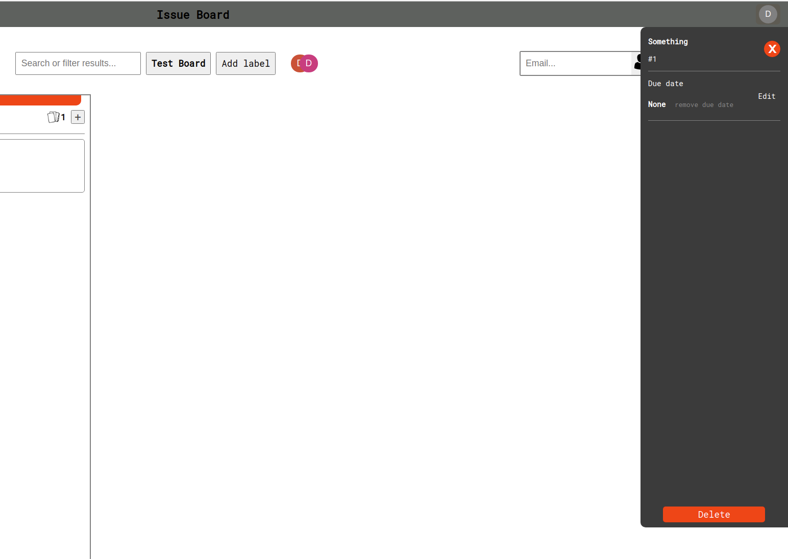
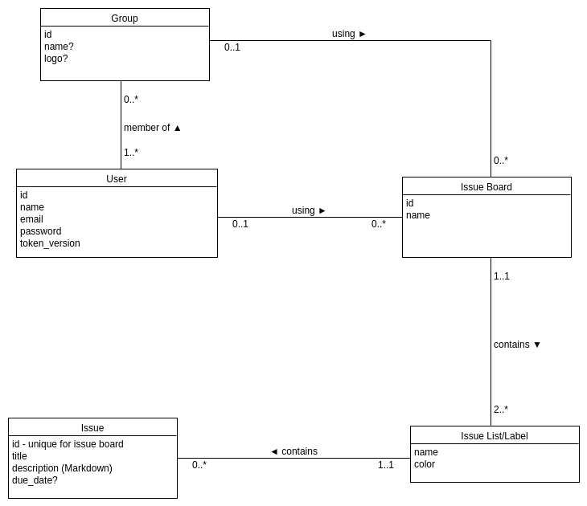

# IssueBoard
Copy of Git Issue Board using Ruby on Rails, PostgreSQL, React, GraphQL  
Made by: Diderik Kramer

## Content
1. [Introduction](#introduction)
2. [Functionality](#functionality)
3. [Future work](#future-work)
4. [Continous Integration](#continous-integration)
5. [ER diagram](#er-diagram)

## Introduction
IssueBoard is a web application made to store issues for projects in boards. Users are able to create their own boards or join groups for collaborative work. All members of the group are able to add new issue boards and invite new members to that group. A user is also able to add members to a non group issue board that they own. Issue board functionality described later.

The web application is made with React, this is developers first time using this framework. It was selected for it's popularity and online support. For styling, the app is made with solely CSS, and not with a CSS-framework. For the backend part of the application, Ruby on Rails is being used. Both backend and frontend will be hosted, but only available from 09:00 - 19:00 GMT+2 / UTC+01:00.

## Functionality

### Registration
* Requires
	* Username 
	* Unique email
	* Password
*  Automatically logs in if user is registered

### Authentication
* JWT Token
	* Access token - 5 minutes
	* Refresh token - 7 days
* Access token sent with HTTP header (Authorization header)
* Refresh token sent as HTTP only cookie
* On access token expiration, new access token is sent if refresh token is set as cookie
* User stored with a token version that is incremented each time a new refresh token is created or logged out. Mainly used for logging out.
* If both tokens have expired, user is required to log in
* User can log out, removing both tokens from browser

### Groups
* User can create groups
* Members of a group can invite new members
* Members of a group can create new issue boards
* User can accept or decline invites to groups
* User can see other members in a group
* User can leave group
* Group is deleted when there are zero members, deleted   
#### User groups page

#### User groups page with form

#### A group page

### Issue boards
* User can create issue boards
* User can change issue board name
* User can delete issue board
* User can add members to issue board for collaborative work
* Automatically creates two labels: Open, Closed
* User can create new labels
* User can delete existing labels
* User can create new issues within labels
* User can modify due date for issues
* User can delete issues
* User can search for issue title
* Drag and drop implementation for both issue cards and issue label cards, order saved in database

#### Issue board page with both issue form and issue label form

#### Issue sidebar

## Future work
* **Styling/animations**. Use more time on styling for a better user experience. This also includes animation and better loading animations. Perhaps also decide on better colors to use. Currently it only has a simple look. 
* **Responsive design**. The web application is not styled for small screen og mobile use. High priority.

* **Assignable issues**. As in Gitlab, a user is able to assign a issue to another user in the same project. This would imply a one-to-one connection between a issue and a user. Highly prioritized.

* **Drag and drop**. Current implementation of drag and drop in a issue board page still contains bugs that should be fixed.

* **Group logo**. Not yet implemented is a group logo. Users should be able to create groups with logos that will be displayed on each group card. Need to look into [Cloudinary](https://cloudinary.com/), where images can be stored, and save the link in database.

* **All issues page**. Create a page for all issues a users has been assigned to. This must be implemented after assignable issues has been completed.

## Continous Integration
Currently only implemented for backend. CI runs everytime development branch is being merged with master branch. It starts a local PostgreSQL server to use as a test database. It then performs the unit tests written in the /backend/test folder.

## ER diagram
### First version

### Current version (ERD created with pgAdmin)
